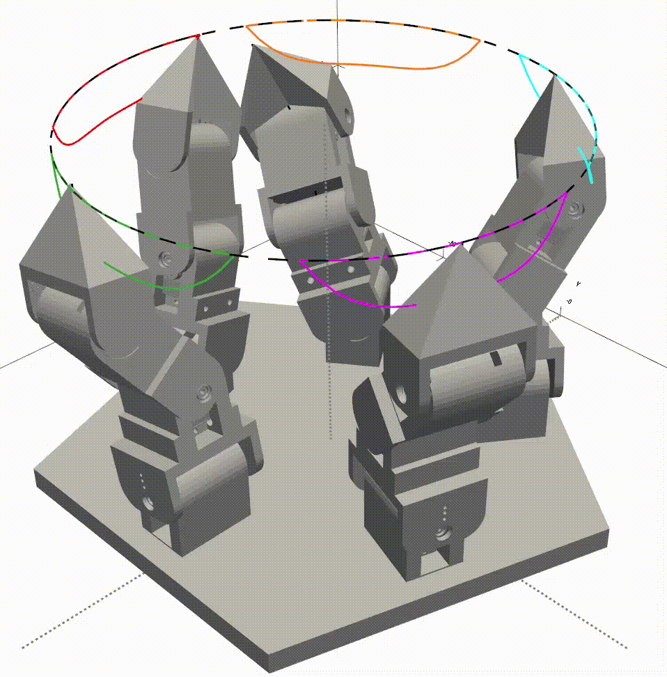
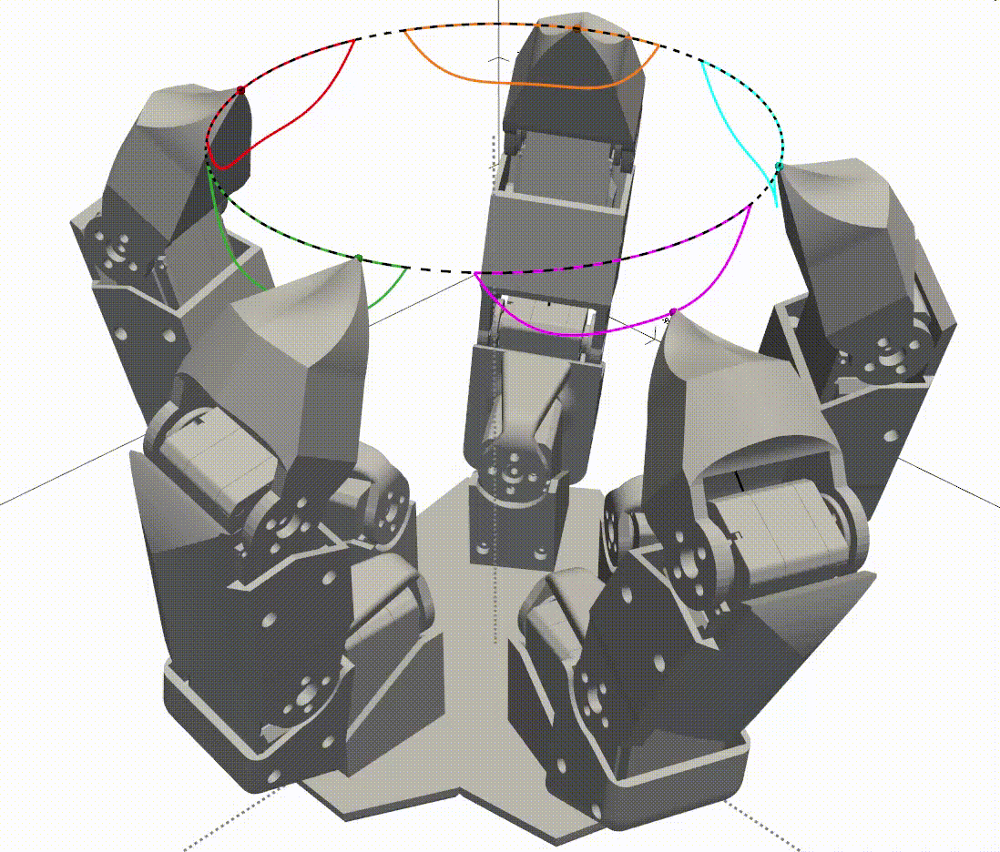
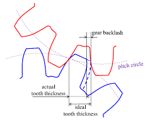
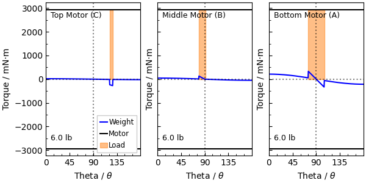
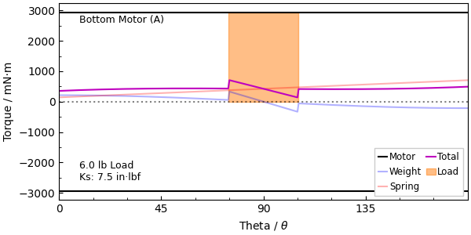
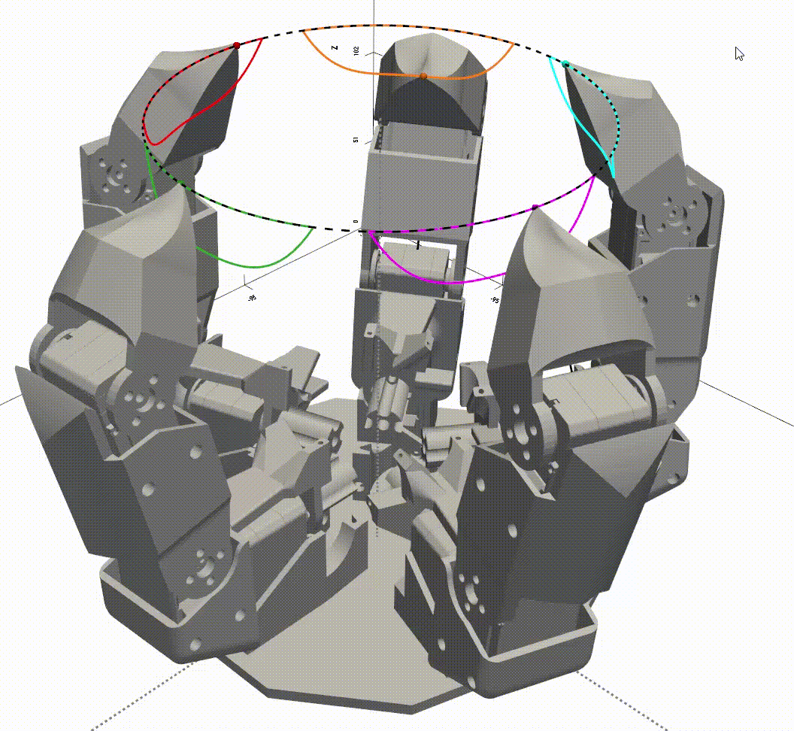
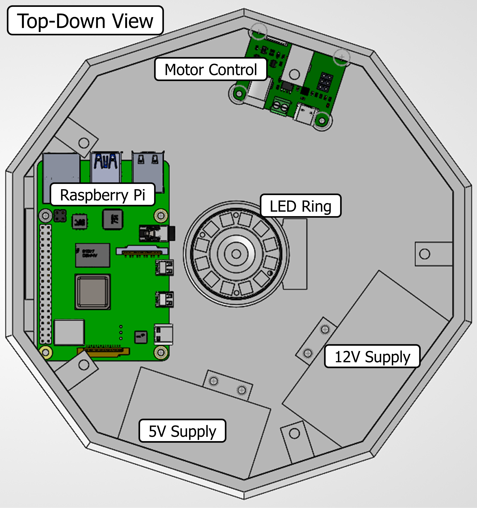
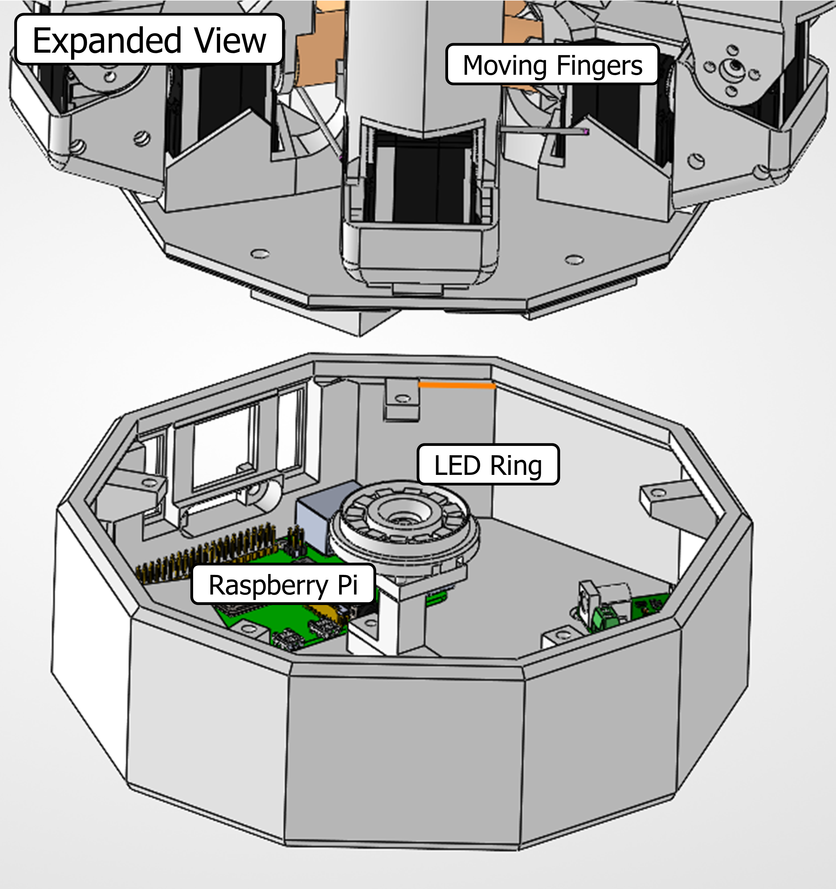
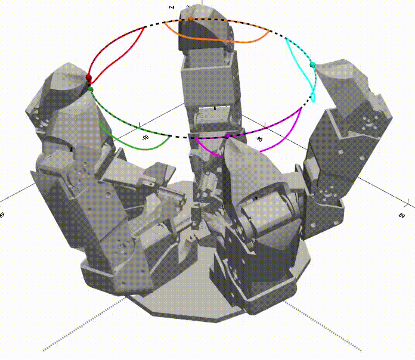

#  Claw Stand

## Hello all! 

This project is inspired by the **BattleBots claw stand robot**:

<div align="center">
  
</div>

---

## Part 1: Mathematical Model

Each finger in the claw contains **3 motors** — **Motor A**, **Motor B**, and **Motor C**.  
Each motor rotates by an angle:  
- Motor A → $\theta_a$  
- Motor B → $\theta_b$  
- Motor C → $\theta_c$  

We need to perform **inverse kinematics** to find the angles needed to position the finger tip at a given **3D coordinate**:

$$(X_p, Y_p, Z_p)$$

<div align="center">
  
</div>

---

## Equation Setup

We’re going from a target point in space $(X_p, Y_p, Z_p)$ to joint angles $(\theta_a, \theta_b, \theta_c)$.

$$
\angle AB = \theta_a \quad \angle BC = \theta_b \quad \angle CT = \theta_c
$$

We also define:

$$
\theta_d = \theta_b - \theta_c
$$

---

### Deriving $Z_p$

$$
Z_p = B\sin\theta_a + C'\sin\theta_a + T'\sin\theta_a + A
$$

Substitute: $C' = C\sin\theta_b, \quad T' = T\sin\theta_d $

So:

$$
\boxed{Z_p = B\sin\theta_a + C\sin\theta_b\sin\theta_a + T\sin\theta_d\sin\theta_a + A} \quad \text{(Eq. 1)}
$$

---

### Deriving $Y_p$

$$
Y_p = B\cos\theta_a + C'\cos\theta_a + T'\cos\theta_a
$$

Substitute: $C' = C\sin\theta_b, \quad T' = T\sin\theta_d$

So:

$$
\boxed{Y_p = B\cos\theta_a + C\sin\theta_b\cos\theta_a + T\sin\theta_d\cos\theta_a} \quad \text{(Eq. 2)}
$$

---

### Deriving $X_p$

$$
\boxed{X_p = C\cos\theta_b + T\cos\theta_d} \quad \text{(Eq. 3)}
$$

---

## Step 1 — Solving for $\theta_a$

Visually, this is true from Eq. (1) and Eq. (2):

$$
\tan\theta_a = \frac{Z_p - A}{Y_p}
$$

So:

$$
\theta_a = atan2(\frac{Z_p - A}{Y_p})
$$

#### *Note: atan2 provides the quadrant and is used here, as atan loses information regarding negatives and associated quadrants.
---

## Step 2 — Solving for $\theta_b$ and $\theta_d$

We now solve for $\theta_b$ and $\theta_d$, given:

$$
Y_p = B\cos\theta_a + C\sin\theta_b\cos\theta_a + T\sin\theta_d\cos\theta_a,
$$

$$
X_p = C\cos\theta_b + T\cos\theta_d.
$$

---

### Step 1 — Simplify the equations

Divide the first equation by $\cos\theta_a$ (assuming $\cos\theta_a \neq 0$) and define:

$$
S = \frac{Y_p}{\cos\theta_a} - B.
$$

Then the system becomes:

$$
C\sin\theta_b + T\sin\theta_d = S,  
$$

$$
C\cos\theta_b + T\cos\theta_d = X_p.
$$

---

### Step 2 — Interpret geometrically

These equations represent a **vector addition** in the plane:

$$
C e^{i\theta_b} + T e^{i\theta_d} = X_p + iS \equiv R e^{i\phi},
$$

where

$$
R = \sqrt{X_p^2 + S^2}, \quad \phi = atan2(\frac{S}{X_p}).
$$

---

### Step 3 — Eliminate $\theta_d$

Using the magnitude condition for the complex sum, we find:

$$
X_p\cos\theta_b + S\sin\theta_b = K,
$$

where

$$
K = \frac{R^2 + C^2 - T^2}{2C}.
$$

Let $A = X_p$, $B = S$, and $R = \sqrt{A^2 + B^2}$.
  
Then:

$$
A\cos\theta_b + B\sin\theta_b = K
$$

can be rewritten as:

$$
R\cos(\theta_b - \phi) = K.
$$

---

### Step 4 — Solve for $\theta_b$

$$
\boxed{\theta_b = \phi \pm \arccos\left(\frac{K}{R}\right)}
$$

Feasibility condition:

$$
\left|\frac{K}{R}\right| \le 1.
$$

If \(|K/R| > 1\), no real solution exists.

---

### Step 5 — Solve for $\theta_d$

For each valid $\theta_b$:

$$
\cos\theta_d = \frac{X_p - C\cos\theta_b}{T}
$$

$$
\sin\theta_d = \frac{S - C\sin\theta_b}{T}
$$

$$
\boxed{\theta_d = atan2(\frac{\sin\theta_d}{ \cos\theta_d})}.
$$


---

### Step 6 — Boundary Condition

The result of $\theta_b$ and $\theta_d$ can yield more than one solution. To guarantee that the joints bend outward:

$$
\theta_d > \theta_b
$$

Remembering that $\theta_d = \theta_b - \theta_c$ and substituting:

$$
\theta_c > 0
$$

guarantees a single solution.

---

### Step 7 — Python Implementation

```python
import numpy as np

def solve_thetas(Zp, Yp, Xp, A, B, C, T, Offset_R):
    """Returns the angles (in radians) of motors to obtain a point in space (Xp, Yp, Zp)"""
    Xp = Xp - Offset_R
    Yp = Yp

    # Helps with breakdown of atan2 at infinity as Yp -> 0
    if Yp < 0.0005 and Yp > 0:
        Yp = 0.0005        
    if Yp > -0.0005 and Yp <= 0:
        Yp = -0.0005
        

    theta_a = np.atan2((Zp-A),Yp)
    ca = np.cos(theta_a)
    
    S = Yp/ca - B
    R = np.hypot(Xp, S)           # sqrt(Xp^2 + S^2)
    phi = np.arctan2(S, Xp)
    K = (R*R + C*C - T*T) / (2.0*C)

    if abs(K/R) > 1.0 + 1e-12:
        return []  # no real solutions

    # clamp for numeric stability
    val = np.clip(K/R, -1.0, 1.0)
    acos_val = np.arccos(val)

    thetab_solutions = [phi + acos_val, phi - acos_val]
    solutions = []
    for tb in thetab_solutions:
        cb = np.cos(tb); sb = np.sin(tb)
        cd = (Xp - C*cb) / T
        sd = (S  - C*sb) / T
        # numeric clamp
        cd = np.clip(cd, -1.0, 1.0)
        sd = np.clip(sd, -1.0, 1.0)
        td = np.arctan2(sd, cd)

        # ensures only one solution
        tc = td - tb

        if tc > 0:
            solutions.append((theta_a, tb, td))
            
    return solutions

```

### Python Model Implementation 

[Model Source Code](https://github.com/drpykachu/Claw-Stand/blob/main/Edition%20V2.0%20-%20Stepper%20Motor/Software/Python/Windows%20-%20Claw%20Stick%20Model%20V2.2.py)

<div align="center">
  
</div>

---

## Part 2: Hardware Selection

The angles needed for reaching a point in (x,y,z) space is now fully defined with the mathematical model. However, more thought is needed for selecting the hardware for turning the mathematicl model into a working phyiscal model

---
### The Motor:

There are several classes of motor that were considered, but servo motors are chosen as the range of movement (<180°), built-in rotary encoder (for position tracking and tuning with PID), and step accuracy (the smaller the better) are ideal. Several makes and models of servo motors were evaluated:

* [S8218 High Speed servo](https://www.cysmodel.com/products/cys-s8218-40kg-digital-metal-gear-servo/)
* [SC09 Series Serial Bus Servo](https://www.waveshare.com/SC09-Servo.htm)
* [ST3215 Series Serial Bus Servo](https://www.waveshare.com/st3215-servo.htm?srsltid=AfmBOorEyoYq279kdzu4ZvWRVoV5O3Idv0StNNJXvp_PE0Ioi92Gx9X2)


### Servo Motor Criteria

The three most important criteria for the servo motors to ensure a success build are as follows:

1. Small step angle (as well as compact)
2. Strength requirement (to hold at least coffee mug)

### Step Angle

The Ball-And-Stick model has the oversight of showing us how the model would react with perfect decimal-point accuracy. In the real world, motors have an angle, the step angle or resolution angle, of how small they can exert movement in discrete steps. For instance, a large step can lead to unwanted behavior. A Computer Aided Design (CAD) was built for the SC09 motors, where the components were designed in mind for 3D printing later on. The model with a 2° step is seen here (notice the choppiness and inaccurate positioning on the the wanted path):

<div style="display: flex; justify-content: center;">
  
</div>

<br>

Choppiness and innacuracy of the fingers is seen, indicating that there will be poor movement and stability. A smaller step angle is needed to ensure smooth control. 

The smallest step angle size and  10x step angle size (closer to actual movement due to internal deadband settings), is seen for each motor below:

| Make    | Min Step Size  | Acutal Step Size | 
|---------|----------------|------------------|
| S8218   |      0.360     |      3.60        |
| SC09    |      0.293     |      2.93        | 
| ST3215  |      0.088     |      0.88        |

A CAD model for the ST3215 was to show the operation for a 0.88° step angle, where much better control smoothness is observed:


<div style="display: flex; justify-content: center;">
  
</div>


The S8218 and SC09 motors were no longer considered as they show poor control for this configuration.

### Strength Requirement
The ST3215 achieves its positional accuracy by using a gearbox. Gearboxes are good for increasing torque (strength) and increasing position resolution, but they are bad because they introduce *backlash*. Backlash is the clearance or lost motion in a mechanism caused by gaps between the parts. If there was no clearance between the gears, any anamoly would cause the gearbox to seize - causing lack or no motion and potential motor failure; so some backlash is desired. However, backlash in this system means that the rotor can move without the output shaft moving, causing a displacement between the modeled position and the actual position (*bad*).

Here is a picture depicting backlash:

<div align="center">
  
</div>

Only one side of the gear teeth is engaged at a time. Once the gears spin the other direction, there will be a moment in time (and space) where the contact has to shift from one side to the other. However, if a sufficient amount of external torque is applied, one side of the gear will be engaged at all times - and therefore eliminating backlash.

Looking at bottom motor (Motor A) for example, gravity will pull the gearings to one side, until 90 degrees, where it will slop over to the other side. Assigning positive torque to a clockwise direction (and thus a negative torque is counter clockwise), the moment ($\tau$) associated for each motor is found as:

$$\tau = \sum_{i=1}^{n} l_i·m_i·g·cos(\theta) + l_L·m_L·g·cos(\theta); $$

$$\tau_C = [T·(m_{p,T})]·g·cos(\theta) + T·m_L·g·cos(\theta)$$

$$\tau_B = [T·(m_{p,T}) + (T+C)·(m_{p,T}+m_{p,C}+m_{m})]·g·cos(\theta) + (T+C)·m_L·g·cos(\theta)$$

$$\tau_A = [T·(m_{p,T}) + (T+C)·(m_{p,T}+m_{p,C}+m_{m}) + (T+C+B)·(m_{p,T}+m_{p,C}+m_{p,B}+ 2m_{m})]·g·cos(\theta) + (T+C+B)·m_L·g·cos(\theta) $$

where $l_i$ is arm length, $l_L$ is load length, $m_{p}$ is mass of plastic, $m_{m}$ is mass of motor, $m_{L}$ is mass of load, and $g$ is gravity. Note that the moments $\tau_B$ and $\tau_A$ are taken as worst-case scenarios of the finger being fully extended.

The torque vs. angle behavior, where the load is only applied during contact with the plate,
is seen here: 


<div align="center">
  
</div>

My father chimed in at this point to point out that the torque measurment only needs to be considered for motors that have angles cross the 90° mark. This agrees with the point that as long there is no change in sign (+/-) of torque, there is no switch over from one gearing side to the other. Thus, motors C and B are removed from further analysis.


An additional torque will be needed to have the gears stay on one side for motor A. A torsion spring will be added to raise the torqe as a function of the angle, with the relationship seen as:

$$\tau_S = K_s\theta$$

The torque increased with the angle moved (assuming a 270° spring deflection) so that the gears are preloaded the angle reaches 90°. The torque behavior with the added spring is seen as:

<div align="center">
  
</div>

The torque is now brought to one side (positive) and remains there for all angles - ensuring that the gears are continuously in contact. Motors A, B, and C are now fully defined. The final model to include the spring hardware (near the bottom, as only motor A needs it) is seen here:

<div style="display: flex; justify-content: center;">
  
</div>

## Part 3: Final Build And Considerations

The translation from theoretical model, to CAD model, to 3D printing and fine-tuning took a considerable amount of time and effort. The considerations for electronics, wiring, polishing, machining, soldering, and coding are not shown here, simply because it is not worth the time and effort type of out the explanations for each aspect. Rather, I wanted to share the aspects to which I thought were the neat.


### Electronics Bay

The fingers that comprise the claw in the presented animations are connectec to a base plate. I chose to make an electronics bay that houses the computer, power supplies, and other ancillary electronics equipment to make the claw a stand-alone piece. The processor chosen to run the claw computations and motor control commands is a Easpberry Pi 5. The motor driver is a 12v serial bus driver. The Pi requires a 5V power supply, and the motor driver require a 12V supply, which are included in the bay as well. Lastly, I included a ring of LED that is oriented upwards to illuminate the object being held. 


<div align="center">
  
</div>
 
<br>
<div align="center">
  
</div> 

<br>

### Camera-Plate Feedback Loop

The claw, finally completed and ready to run, was initially only able to hold spherical objects as they are symmetrical in any orientation. Any spherical object would auto-correct if there was any mis-calibration in fingertip position. Holding other types of objects, such as flat objects (plate), would be a challenge as any fingertip position mis-calibration would lead to drift. Enough drift, and the plate falls off the plate. With the addition of a small raspberry pi camera, along with the processing power of the Raspberry Pi and the ulimtation aspect of the LED ring, image processing feedback loop was developed to track the location of plate. If the plate drifted too far to one side, the raspberry pi goes into "fixing mode" to bring the plate back to near center. *Development of this image correction hardware and software took by far the longest amound of time to make*

The animation of a drift detection and correction is seen here:

<div style="display: flex; justify-content: center;">
  
</div>

<br>
Where the dashed black line is the normal path to follow, and the gray curve is the correction path. When a drift threshold is met (15 mm from center), the all fingers move in sync to move the plate back to the center. After the translational movement, the fingers need to reset their position from the correction path to the normal path. I first attempted to hold each finger still and move one at a time, but there were instances of imbalance between fingers due to the position on the path, and the the plate would fall off. The resetting of the fingers in this animation differs from the former by having the finger position reset during the downsweep. This is observed by a finger leaving on the dashed gray circle during the start of the downsweep, and touching the dashed black circle on the end of the downsweep.

## Gallery

### Electronics Bay

<div align="center">
  
</div> 

<br>

### Claw - Stagnant

<div align="center">
  
</div> 

<br>

### Claw - Moving
